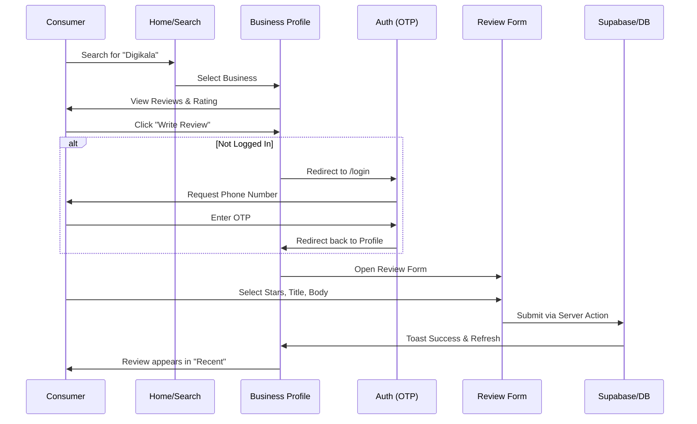
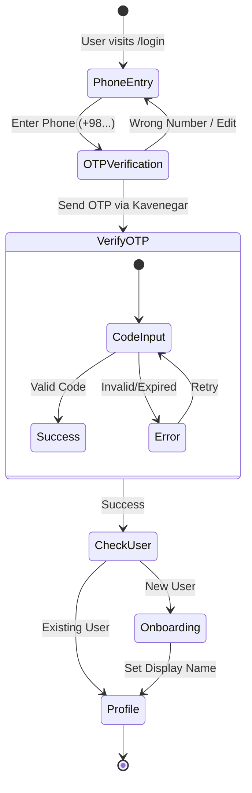
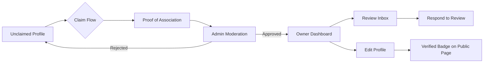
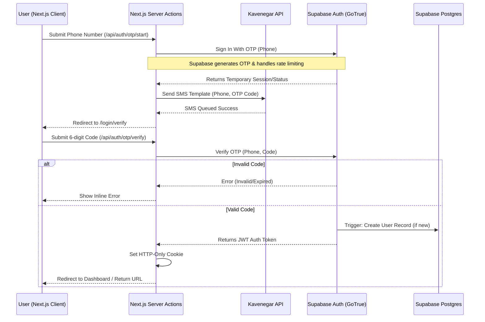

# Nazarato Architecture Diagrams

Based on the `pages-master.md` documentation, these diagrams visualize the information architecture, user flows, and technical integrations for the platform.

## 1. Information Architecture (Sitemap)
Maps the public, authenticated, and administrative routes, showing how the product is segmented by user role.

```mermaid
graph TD
    %% Global Routes
    Root[/] --> Home[Home /]
    Root --> Search[/search]
    Root --> Categories[/categories]
    Root --> IGShops[/instagram-shops]
    Root --> Reviews[/reviews]
    Root --> Blog[/blog]
    
    %% Business Hierarchies
    Categories --> CatDetail[/[slug]]
    Home --> BizProfile[/company/[slug]]
    Home --> ShopProfile[/shop/[handle]]
    
    BizProfile --> WriteReview[/write-review]
    BizProfile --> Claim[/claim]
    ShopProfile --> WriteReview
    
    %% Auth Group
    Root -.-> AuthGroup((Auth Group))
    AuthGroup --> Login[/login]
    Login --> Verify[/login/verify]
    
    %% User Group
    Root -.-> UserGroup((User Area))
    UserGroup --> Profile[/profile]
    UserGroup --> Saved[/saved]
    UserGroup --> Settings[/settings]
    
    %% Business Group
    Root -.-> BizGroup((Owner Area))
    BizGroup --> ForBiz[/for-business]
    BizGroup --> Dashboard[/business]
    Dashboard --> BizReviews[/business/reviews]
    
    %% Admin Group
    Root -.-> AdminGroup((Admin Area))
    AdminGroup --> Mod[/admin/moderation]
    AdminGroup --> Reports[/admin/reports]
```

## 2. "North-Star" User Journey
Represents the primary goal: a consumer finding a business and writing a high-quality review.



## 3. Authentication & Onboarding Flow
Clarifies the login-to-onboarding logic using the phone-based OTP model via Kavenegar.



## 4. Business Owner Lifecycle
Visualizing how a business goes from "Unclaimed" to "Managed" by an owner.



## 5. Technical Architecture: Supabase + Kavenegar OTP Flow
Details the backend interaction for the passwordless phone authentication.


