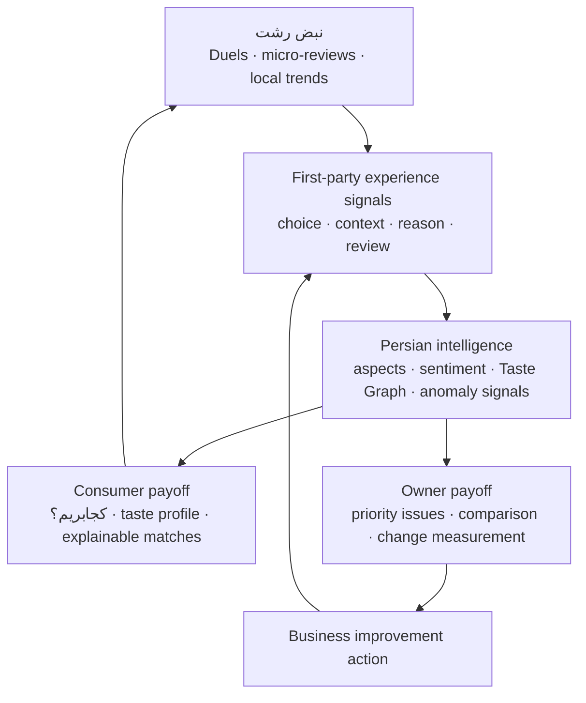

# Nazarato — Nabz Rasht MVP

Status: **locked for specification and implementation**

Decision date: 2026-09-02

Delivery window: 14 days
Initial market: Rasht cafés and restaurants

## Product thesis

Nazarato is not another nationwide directory and does not compete on listing
count. The consumer product makes local discovery entertaining; those
interactions create first-party, context-rich preference and experience data;
the technical product converts that data into explainable recommendations and
actionable customer-voice intelligence for businesses.

The product has three connected surfaces:

The consumer promise is **«برای موقعیت من کجا بهتر است و چرا؟»**. The owner
promise is **«مشتری‌ها دقیقاً درباره چه چیزی حرف می‌زنند و بعد چه کاری باید
انجام دهم؟»**.

## Spec: Nabz Rasht consumer loop

**Problem.** A person in Rasht who wants a café or restaurant can find addresses
and phone numbers in directories, maps, or social media, but comparing places for
a specific situation still means opening many profiles and trusting scattered,
low-context opinions. A business owner sees ratings and comments but cannot
reliably turn them into a prioritized improvement or measure whether the change
worked.

**User action.**

1. The visitor opens Nazarato and sees `نبض رشت`, not a generic directory hero.
2. They choose a situation such as `قرار دونفره`, `کار با لپ‌تاپ`, `اقتصادی`, or
   `غذای محلی`.
3. They answer a low-friction Duel between two eligible businesses or leave a
   short contextual reason; no login is required for the first interactions.
4. Nazarato immediately updates the result and explains which preference signal
   the choice added.
5. After enough signals, `کجابریم؟` returns a short ranked recommendation with
   reasons and links to the supporting reviews or votes.
6. Signing in saves the Taste Graph across devices and enables a full review.
7. Claimed businesses see aggregated aspect trends and choose one improvement to
   track; they never see a private individual Taste Graph.

**Data changes.**

- `business_sources`: provenance, permission basis, capture time, source
  reference, field payload, and deduplication hash for every seeded profile.
- `comparison_votes`: scenario, winner, loser, optional reason, authenticated
  user or short-lived anonymous session, and timestamp.
- `review_analyses`: versioned Persian normalization, aspect/sentiment output,
  evidence spans, confidence, issue cluster, and suspicious-pattern score.
- `review_analysis_corrections`: retained model output and human replacement
  labels for versioned evaluation; private under RLS.
- `taste_profiles`: user-level dimension weights and evidence count; private to
  that user and never exposed to businesses.
- Existing `businesses` and `reviews` remain the canonical entities. The first
  migration extends them only where normalized local discovery fields are
  required.

**Failure modes.**

- **Cold start / weak evidence:** show «داده کافی نداریم» and the source count;
  never manufacture an AI explanation or rank.
- **Coordinated voting or duplicate submissions:** rate-limit, down-weight new or
  repeated sessions, flag anomalies for human review, and keep flagged content
  out of public rankings until reviewed.
- **Wrong business data or duplicate profiles:** retain field-level provenance,
  expose correction and Claim flows, and merge rather than silently overwrite.
- **AI misreads Persian slang or sarcasm:** show cited examples and confidence,
  allow a human correction, and retain model/version history for evaluation.
- **Harmful ranking or defamation:** use positive scenario matching rather than
  «بدترین‌ها», require minimum evidence thresholds, and preserve report/dispute
  workflows.

**Out of scope (this iteration).** Nationwide coverage, all business categories,
a full map product, rewards or cash incentives, public leaderboards, generic AI
chat, autonomous deletion of suspicious reviews, scraping third-party directories,
and owner billing.

**Done when.** A real visitor can make five Rasht café/restaurant choices, receive
an evidence-grounded recommendation and taste summary, submit a contextual review,
and one pilot owner can see a cited issue summary and record an improvement action.

## MVP surfaces

| Surface | MVP job | Immediate payoff |
| --- | --- | --- |
| `/` — `نبض رشت` | Scenario selector, Duels, micro-review prompts, local pulse | A useful or interesting result after every interaction |
| Existing search/profile pages | Fallback lookup, evidence, contact, Claim, full reviews | Utility and trust without rebuilding a directory |
| `کجابریم؟` sheet | Ask for occasion, budget band, group, neighborhood, and priorities | Three explained matches; no unsupported answer |
| Taste profile | Show current preference dimensions and evidence count | Identity, personalization, and a reason to return |
| `/business/insights` | Rank recurring aspects and cited issues; record one action | A concrete business decision, not a vanity chart |

## Intelligence boundary

The knowledge-based candidate is the technical layer, not the feed UI:

- deterministic Persian normalization and versioned aspect extraction;
- confidence-aware sentiment and issue clustering with cited evidence;
- a preference model built from contextual pairwise choices (Taste Graph);
- recommendation ranking that explains why each result fits the request;
- anomaly signals for suspicious or coordinated activity, followed by human
  review rather than automatic punishment;
- before/after measurement when a pilot business records an improvement.

Every model output must store its model identifier, version, input reference,
confidence, and evaluation status. A generic API wrapper or an uncited chat answer
does not satisfy this boundary.

## Data and legal boundary

- Bilbooard and other directories are competitors and product references, not
  default datasets.
- Seed only from owner submissions, manual research of factual public contact
  information where reuse is lawful, open/licensed sources, or written permission.
- Do not copy third-party descriptions, images, reviews, ratings, or bulk listing
  datasets without an applicable licence or written permission.
- Imported fields must keep provenance and a permission basis. Unknown permission
  means `quarantined`, not published.
- Open datasets must also retain license name, license URL, and attribution text.
  A separate publication approval stays false until product-level obligations
  such as visible attribution are ready.
- Public business reads now fail closed unless the profile status is public and
  an approved provenance row exists. Open-data profiles render the approved
  attribution and validated HTTPS source/licence links; an approved source for
  an existing pending identity still requires manual field reconciliation.
- Pilot review/support history requires explicit permission from the business and
  must preserve source, time range, and deletion expectations.

## Fourteen-day execution order

| Window | Codex-owned deliverable | Founder dependency | Exit evidence |
| --- | --- | --- | --- |
| Days 1–2 | Source-aware schema, migration, importer contract, deterministic fixtures | None | Tests prove provenance, idempotency, and deduplication |
| Day 3 | Curated 50-record Rasht café/restaurant source snapshot | Three pilot introductions | Every candidate has provenance; publication remains gated |
| Days 4–5 | `نبض رشت`, scenario selector, Duels, and micro-review capture | One quick Persian copy review | Five interactions work on mobile without login |
| Days 6–7 | Persian aspect/sentiment baseline, evidence spans, confidence, human correction | Secure AI credential only if real inference is enabled | Versioned evaluation set and baseline metrics |
| Days 8–9 | Taste Graph and `کجابریم؟` recommendation sheet | One share to a small Rasht test group | Recommendations cite supporting signals |
| Day 10 | Harden existing Claim/OTP path for the pilot | SMS provider access before real OTP | One owner completes Claim end to end |
| Days 11–12 | Owner insight, one improvement action, and before/after metric | Pilot owner gives a 15-minute reaction | Owner chooses one real action from cited evidence |
| Days 13–14 | QA, security/privacy pass, deployment proof, and MVP evidence pack | Go/no-go confirmation | Critical flows and release identity verified |

Current private supply status (2026-09-05): the tracked OSM snapshot's 50
candidates have been imported to development Supabase as 50 pending businesses
with 50 quarantined provenance rows. A repeated apply created no duplicates.
A separate gitignored Drive snapshot contains 37
quarantined café/restaurant candidates. Three normalized names overlap exactly;
they remain manual match evidence, not merged or published profiles. The Drive
source contributes factual profile fields only and does not provide review text
for the Persian analysis evaluation set.

The admin-only `/admin/businesses/osm-review` queue now makes all 50 staged rows
inspectable without changing them. It shows category, contact completeness,
coordinates, capture date, and allowlisted OSM/ODbL references; local search and
filters operate on a minimal DTO. There is deliberately no edit, approve, reject,
or publish action in this slice.

Current publication-boundary status (2026-09-05): direct profiles, similar
results, category and Instagram-shop listings, popular/saved results, and
bookmark mutations require an approved `business_sources` record in addition to
an active/merged business status. Approved open-data credits render on the
profile and were checked at 390 px and 1280 px with no overflow or console error.
The schema migration is applied to the linked development project. The OSM
snapshot is now staged remotely, but remains fully quarantined: verification
found zero active businesses, zero approved sources, and zero public records.

Current consumer-loop status (2026-09-03): `/` now leads with an interactive
`نبض رشت` demo containing four scenarios, five deterministic Duels per scenario,
an optional 120-character contextual reason, immediate signal feedback, a Taste
Graph summary, and three explained recommendations. All eight displayed places
are explicitly fictional and labelled as demo data; the quarantined Drive and OSM
records are not loaded into the component. The interaction is intentionally
in-memory in this slice and is deliberately not connected to the production vote
endpoint because fictional IDs must never enter the evidence store.

`POST /api/nabz/votes` now defines the production persistence boundary for the
next slice. It accepts only same-origin JSON no larger than 4 KiB, validates the
Rasht scenario and two distinct UUID business IDs, caps optional reasons at 120
characters, rate-limits both the signed/anonymous identity and network, and stores
only a SHA-256 hash of the anonymous cookie token. Before insert it requires both
businesses to be active and to have an approved `business_sources` row. Duplicate
pair/scenario/day votes return an idempotent success response. The endpoint is not
wired to the fictional UI; applying the migration and binding two or more truly
publication-approved businesses remain the next integration gates.

Current intelligence status (2026-09-03): the deterministic
`nazarato-fa-rules/0.1.0` baseline normalizes Persian text, emits six aspect
families plus sentiment, cites exact normalized-text spans, clusters negative
issues, and flags suspicious patterns for human review without deletion. On a
50-item explicitly synthetic development set—including 20 deliberately difficult
out-of-lexicon comments—it records 66.0% sentiment accuracy, 92.73% aspect
micro-F1, 78.0% issue-cluster accuracy, and 100% valid evidence spans. These are
not pilot metrics. The method, dataset hash, limitations, and real-data gate are
recorded in `docs/persian-intelligence-baseline.md`.

Current Taste Graph and concierge status (2026-09-03): Duel contributions are
now weighted by the selected scenario, and every visible taste dimension links
back to the exact Duel prompt, selected fictional place, and optional reason
that shaped it. The `کجابریم؟` panel collects occasion, budget band, group size,
preferred neighborhood, and up to three priorities, then deterministically
ranks three fictional examples with links to supporting taste signals. Fewer
than three choices returns `داده کافی نداریم`. An anonymous session stores only
validated selected fixture IDs on the same device for seven days; it discards
free-text reasons and recomputes scores from trusted fixtures on restore. Login
is presented as the cross-device boundary, but real account persistence remains
unwired until the Supabase migration and pilot data are available.

Current owner-decision status (2026-09-04): `/business/insights` now ranks only
patterns supported by at least three independent reviews at 0.55 average
confidence, attaches review citations, and withholds sparse/weak candidates. An
owner can append a correction without deleting the model output and can turn a
supported issue into one active improvement cycle with a 90-day baseline,
reduction target, follow-up date, model/version snapshot, and storage for the
later observed result. Published reviews receive a best-effort durable analysis.
The private analysis and reversible improvement-action migrations are applied to
the linked development Supabase project, but no real pilot analysis, correction,
or action row exists yet; live calculations therefore remain non-pilot evidence.
No Taste Graph or private
user-preference field is queried for this owner surface. Real owner selection and
the later before/after observation remain pilot gates.

## Success evidence, not vanity metrics

- 50 Rasht candidate profiles with field-level provenance and no copied
  third-party content; only publication-approved rows appear in the product.
- Three consenting pilot businesses.
- At least one complete consumer path: five signals → taste summary → explained
  recommendation → contextual review.
- A retained labelled evaluation set for Persian aspects/sentiment with recorded
  baseline quality; the metric and threshold are chosen after inspecting the real
  sample, not invented in advance.
- At least one pilot owner selects an improvement from cited customer evidence.
- No claim that the product is دانش‌بنیان until the prototype, technical command,
  evaluation evidence, company, and current official assessment criteria align.

## What the founders provide

Nothing is required to start Days 1–2. The founder-only inputs are deliberately
limited:

1. **By Day 3 — three introductions:** business name, owner/decision-maker contact,
   and permission to discuss a pilot. Codex prepares the message and intake form.
2. **Before live data import — consent:** permission to create/Claim the profile
   and a separate explicit yes/no for importing historic feedback. Codex handles
   the file and mapping work.
3. **Before real integrations — secure access:** Supabase project credentials,
   an AI provider key, and later an SMS provider account/credit. Put secrets only
   in the local/deployment environment; never paste them into Trello, docs, email,
   or Git. No paid provider is enabled without explicit spend approval.
4. **On Day 8 or 9 — one distribution action:** send the pilot link once to a
   small Rasht group. Codex supplies the final copy and link.
5. **Decisions:** answer only genuine blockers, ideally in one 20–30 minute review
   each week. Everything else—product, design, implementation, tests, research,
   Trello, and completion reports—belongs to Codex.

Current local credential check: Supabase, Gemini, JWT, and VAPID values are not
configured in `.env.local`. This is not a blocker for specification, schema, or
fixture-backed development; it becomes a blocker only at the integration and live
pilot gates above.
