# نظراتو — Page & Flow Diagrams

> Visual companion to [`pages-master.md`](./pages-master.md). All diagrams are Mermaid — they render on GitHub and in most Markdown viewers.
> When `pages-master.md` changes, update the matching diagram here.

Generated: 2026-05-21

---

## 1. Sitemap (information architecture)

Route groups `(auth)` `(user)` `(business)` `(admin)` scope layouts without appearing in the URL.

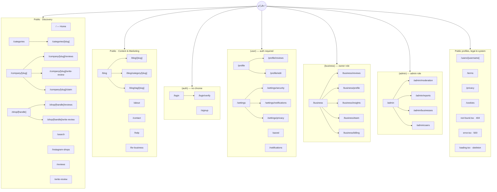

---

## 2. Audiences → areas of the site

Three audiences share one site. This shows which surfaces each touches.

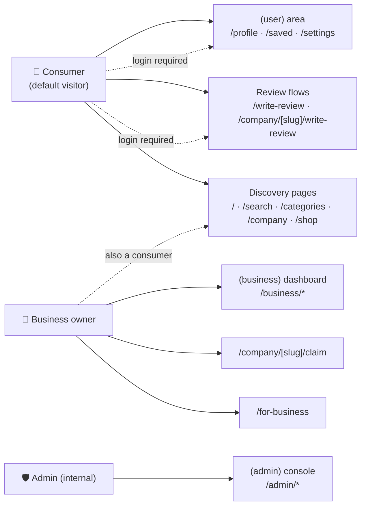

---

## 3. North-star journey

> North-star action: *a consumer writes a real, useful review about an Iranian business.*

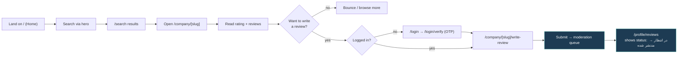

---

## 4. Phone OTP auth flow

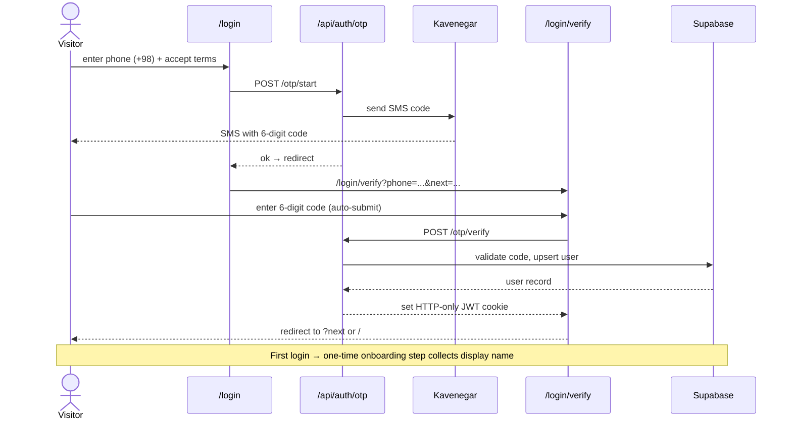

---

## 5. Write-review flow (auth gate)

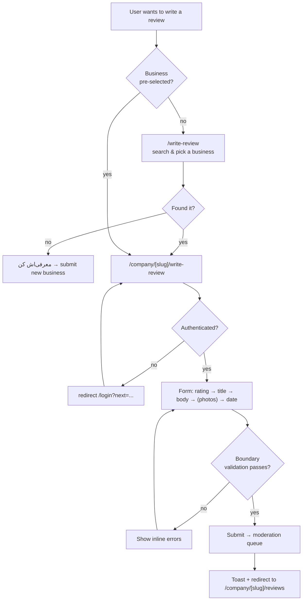

---

## 6. Review lifecycle (moderation states)

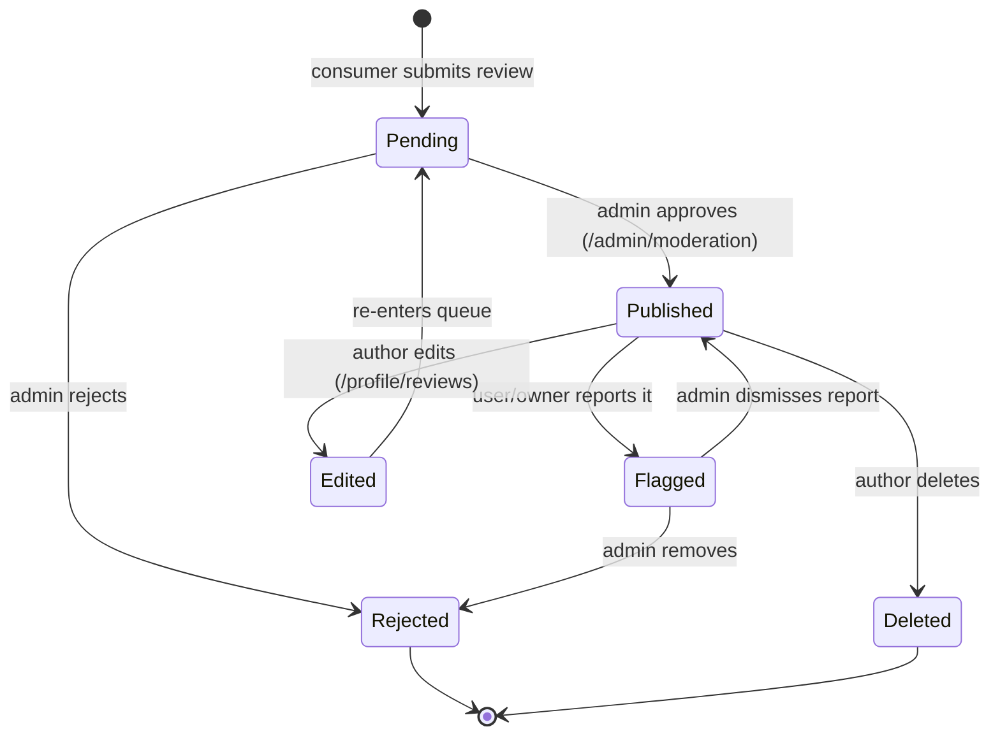

---

## 7. Claim-business flow

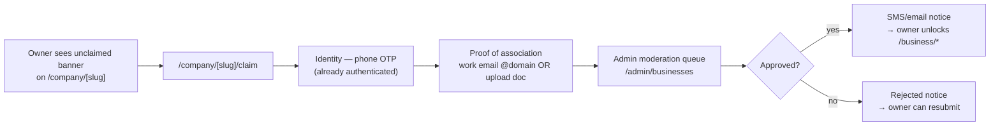

---

## 8. Route-group access guards

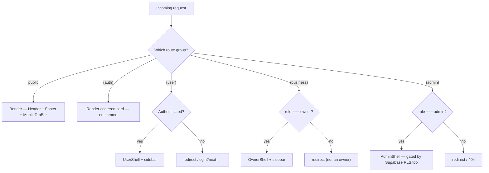

---

## 9. Shared-component reuse map

> Extract `<ReviewCard />`, `<IgShopCard />`, `<BusinessCard />` **before** building search/profile/reviews pages — otherwise each page duplicates ~150 lines of JSX.

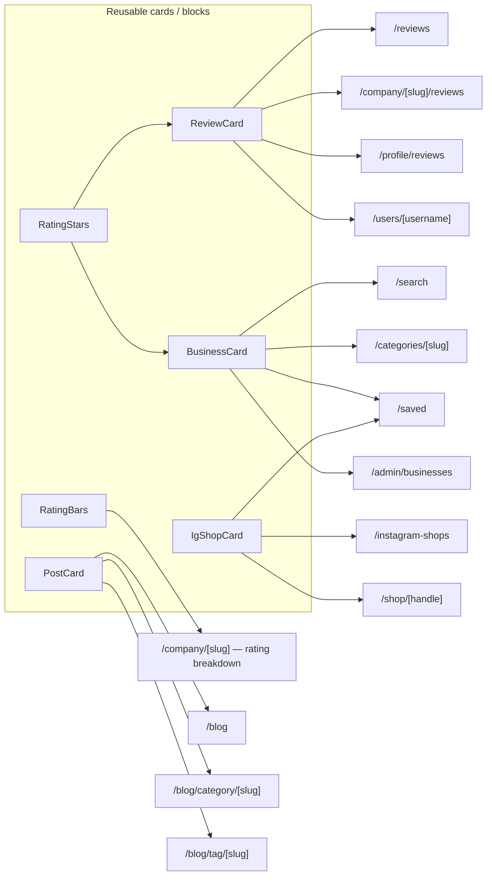

---

## 10. Build order (phases)

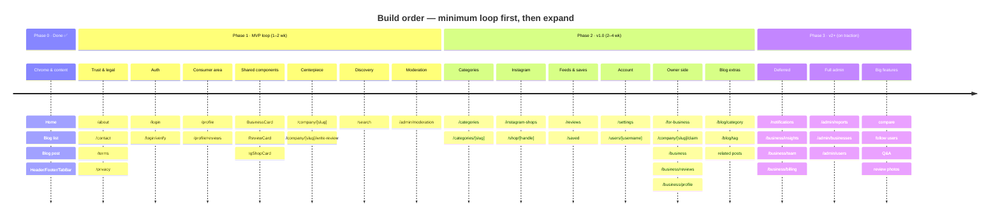

---

## 11. Page status overview

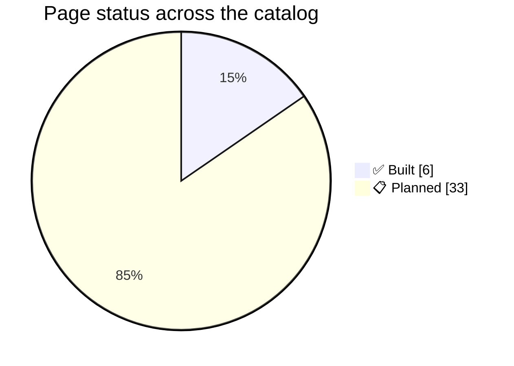

> Built: `/`, `/blog`, `/blog/[slug]`, `/about`, `/contact`, plus core chrome. Everything else in §2 of the master doc is 📋 planned.
