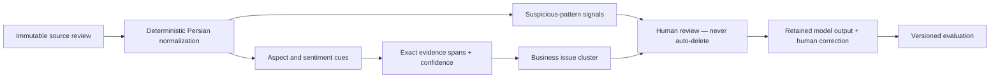

# Nazarato Persian customer-voice baseline

Status: **development baseline implemented; real pilot evaluation pending**

Evaluation date: 2026-09-03<br>
Model: `nazarato-fa-rules` / `0.1.0`

## Why this exists

This is the first measurable technical layer behind Nazarato's owner product. It
turns Persian customer comments into inspectable signals without calling a paid
AI provider. It is deliberately a small deterministic rules baseline, not a
claim that Persian language understanding is solved.



## Output contract

`analyzePersianCustomerVoice` returns:

- the normalized text and an explicit `normalized_text_utf16` offset basis;
- model ID and version;
- one of `positive`, `neutral`, `mixed`, or `negative`;
- detected aspects for taste, service, value, atmosphere, cleanliness, and wait
  time, each with mentions, positive/negative weight, net score, and confidence;
- exact evidence spans whose excerpts can be sliced back from normalized text;
- a stable business issue cluster when negative evidence exists;
- a bounded suspicious score plus human-review reasons; and
- overall confidence.

Suspicious content can produce only `needs_human_review` or `clear`. The module
has no deletion action. Original review text is not overwritten.

Human corrections retain both the reviewed model result and the corrected human
label. The Nabz migration now provides the private, RLS-protected
`review_analysis_corrections` table in the linked development Supabase project
for this append-only evaluation trail; it remains empty until a real pilot run.

## Reproducible development evaluation

Run:

```bash
npm run evaluate:intelligence
```

Dataset:
`data/evaluation/persian-customer-voice.synthetic.json`

SHA-256:
`a1aa0df2371940b39c2861acb9f19799031738d18d3e2f736078a8017da10333`

The dataset contains 50 hand-written fictional café/restaurant comments. The
last 20 deliberately include unseen phrases, colloquial wording, implicit
complaints, and vocabulary outside the rules. It contains no scraped reviews,
real customer data, or claims about real businesses.

| Metric | Result |
| --- | ---: |
| Sentiment accuracy | 33 / 50 = **66.0%** |
| Aspect micro-precision | **98.08%** |
| Aspect micro-recall | **87.93%** |
| Aspect micro-F1 | **92.73%** |
| Issue-cluster accuracy | 39 / 50 = **78.0%** |
| Evidence span validity | 96 / 96 = **100%** |

These are development-set numbers, not pilot quality or proof of generalization.
The high aspect precision partly reflects the narrow six-aspect vocabulary. The
66% sentiment score exposes the expected weakness on implicit meaning, slang,
and phrases not present in the lexicon. No threshold has been selected to make
the result look successful.

## Known limitations

- It does not understand sarcasm, broad context, misspellings, or many Gilaki and
  colloquial Rasht expressions.
- A nearby aspect keyword can occasionally attach a sentiment cue to the wrong
  aspect.
- Confidence is a transparent evidence-coverage heuristic, not a calibrated
  probability.
- Suspicious-pattern signals detect formatting and contact patterns; they do not
  prove fraud or coordinated behaviour.
- The baseline is not yet invoked after a real review submission. Its tables are
  applied to the configured development Supabase project but contain no real
  pilot analyses yet.

## Gate for the real pilot baseline

Card 06 is not complete until a consenting pilot supplies an approved sample.
The minimum useful next evaluation is 50–100 de-identified Persian feedback
items, independently labelled for sentiment, aspects, and primary issue cluster.
The source, time range, permission, deletion expectation, labeller, and label
guideline version must be recorded. We then freeze a held-out split before
changing the model and report the same metrics separately for development and
held-out pilot data.

No AI key is required for the current rules baseline. A paid or hosted model is
introduced only if the pilot errors justify it and the founders approve the
provider and spend.
