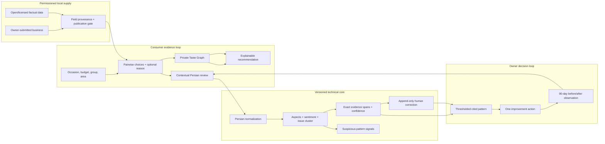

# Nazarato MVP Pilot Evidence Pack

Status: **local technical candidate; not yet a verified live pilot or an approved
knowledge-based product**

Evidence cut-off: **2026-09-05** 
Branch: `codex/osm-prescreening` 
Evidence commits: `84f7acf` through `d9cb7c9`, plus the current pre-screening change

## 1. Executive verdict

Nazarato now has a credible technical product direction: an evidence-grounded
recommendation and Persian customer-voice system for Rasht cafés and restaurants.
The defensible product is not the public directory by itself. It is the connected
technical layer that turns contextual choices and reviews into a private Taste
Graph, explainable recommendations, cited issue patterns, human corrections, and
measurable owner improvement actions.

| Question | Current answer | Evidence status |
| --- | --- | --- |
| Is the differentiated MVP implemented? | **Partly yes.** All core journeys exist locally, but real persistence and provider-backed paths are not integrated. | Amber |
| Is the Persian intelligence measurable? | **Yes, on synthetic development data only.** The model and dataset are versioned and reproducible. | Amber |
| Can a real business complete the pilot today? | **No.** Supabase migrations, approved profile data, Kavenegar delivery, a deployment, and a consenting owner are still missing. | Red |
| Is the product ready to be presented as دانش‌بنیان? | **No.** The live product stage, real technical-operation evidence, pilot data, and current evaluator confirmation are not complete. | Red |
| Should development continue in this direction? | **Yes.** The current direction maps plausibly to official intelligent-recommender and data-analysis product categories. | Green |

The practical decision is therefore **continue engineering, do not submit or make
eligibility claims yet**.

## 2. Product and evidence architecture

The architecture deliberately separates private individual preference data from
business analytics. Owner surfaces never query or expose a user's Taste Graph.

## 3. Current official product fit

This is a product-readiness mapping, not a legal opinion or an eligibility
decision. It was checked on 2026-09-04 against the official Deputy for Development
of Knowledge-Based Companies publications.

The current evaluation bylaw, approved on 1404/07/14, requires all three of the
following for the submitted product or service:

1. a production stage - at least a technically reviewable laboratory-scale
   product; service production is evidenced through formal sales records;
2. a qualifying technology level - above the average technology available in
   Iran and requiring research and development by an expert technical team; and
3. demonstrable command of the technical knowledge inside the company together
   with the relevant R&D team.

Its technical-command appendix focuses on substantial design of a main subsystem,
integration, or a complex production process; internal design, genuine reverse
engineering, or absorbed and improved technology transfer; and mastery of the
design rationale. It also identifies R&D spend and staff, stable specialist
customers, technical collaborations, standards, and performance approvals as
possible evidence.

The winter 1404 detailed IT criteria make the product-stage requirement stricter
in practice: software should be a stable release rather than an idea, incomplete
code, MVP, or experimental version; claimed core modules must be implemented and
the product must be offerable to a prospective customer. The same publication
names architecture, algorithmic complexity, data analysis, automation, APIs,
security, scalability, operational intelligence, monitoring, documentation,
version control, CI/CD, automated tests, support, and a capable team as technical
signals an evaluator may inspect.

### Best current category mapping

| Priority | Official winter 1404 path | Nazarato fit | Decision |
| --- | --- | --- | --- |
| Primary | ICT and computer software → application software → content-oriented software → search and recommender engines → **intelligent recommender systems** | Taste Graph plus scenario-aware, evidence-grounded ranking | Use as the leading candidate mapping |
| Secondary | ICT and computer software → platforms → data-management and analysis services → data-processing and analysis tools → **data mining and machine learning** | Persian review analysis, clustering, trend evidence, before/after measurement | Use to explain the technical subsystem, subject to evaluator interpretation |
| Secondary | ICT and computer software → platforms → data-management and analysis services → **integrated analytical platforms** | Owner insight workspace and improvement loop | Plausible future B2B positioning after real integration |
| Not yet defensible | AI platforms → model development → **natural-language processing framework (NLP)** | Current engine is an application-specific deterministic baseline, not a reusable NLP framework | Do not claim in the present application |

The chosen claim should be one coherent product with technical subsystems, not a
collection of category names.

## 4. Evidence inventory

Legend: **verified** means reproducible locally; **implemented** means code exists
but the real environment or user evidence is missing; **planned** means the
acceptance path is defined but not complete.

| Capability | Implementation evidence | Verification evidence | State |
| --- | --- | --- | --- |
| Rasht consumer loop | `components/nabz/NabzRasht.tsx`, `components/nabz/nabz-engine.ts` | Unit tests and targeted desktop/mobile Playwright coverage | Verified with fictional fixtures |
| Private Taste Graph | `components/nabz/nabz-engine.ts`, `components/nabz/anonymous-taste-session.ts`, `components/nabz/TasteEvidencePanel.tsx`, `components/nabz/SavedTasteProfileCard.tsx`, `components/nabz/actions.ts`, `lib/nabz/taste-profile-input.ts` | Co-located engine, input-boundary, server-action, and presentation tests plus signed-in save/clear/reload QA at 390 px | Verified locally; versioned account save and aggregate current-model readback are wired; real pilot evidence remains open |
| Explainable concierge | `components/nabz/concierge-engine.ts`, `components/nabz/ConciergePanel.tsx` | Scenario, evidence, and weak-signal tests | Verified with fictional fixtures |
| Real vote boundary | `app/api/nabz/votes/route.ts`, `lib/nabz/vote-contract.ts`, `lib/nabz/supabase-vote-repository.ts` | Boundary, origin, size, rate-limit, eligibility, and idempotency tests | Schema connected; approved pilot IDs and live write not yet exercised |
| Persian customer voice | `lib/intelligence/customer-voice-baseline.ts` | Reproducible 50-item synthetic evaluation and unit tests | Verified development baseline only |
| Analysis durability | `lib/data/review-analysis-persistence.ts`, `review_analyses` schema | Persistence-path tests plus remote schema probe | Remote schema applied; real submission persistence not yet exercised |
| Human correction | `app/(business)/business/insights/actions.ts`, `review_analysis_corrections` schema | Correction and fail-closed evidence tests | Implemented; real owner not exercised |
| Owner cited insight | `lib/data/owner-action-insights.ts`, `app/(business)/business/insights/page.tsx` | Requires 3 distinct reviews and 0.55 average confidence; weak evidence is withheld | Verified locally |
| Improvement measurement | `business_improvement_actions` migration and owner actions | Reproducible baseline tests; 90-day observation contract | Implemented; follow-up outcome pending |
| Claim and OTP | `lib/auth/`, `app/company/[slug]/claim/`, `app/(admin)/admin/claims/` | Replay, expiry, signature, race, proof, and authorization tests | Implemented; provider-backed owner run missing |
| Provenance-aware import | `lib/import/business-import.ts`, `lib/import/osm-quarantine-batch.ts`, `scripts/import-rasht-osm-quarantine.mts`, `data/rasht-osm-businesses.json` | Validation, collision guard, idempotency, snapshot, migration, and remote postflight checks | 50 pending businesses + 50 quarantined sources remotely; zero public records |
| Explainable supply pre-screen | `lib/admin/osm-prescreen.ts`, `lib/admin/osm-review.ts`, admin OSM queue | Versioned rule tests, real 50-row distribution, filters, reason display, and 390/1280 px authenticated browser checks | 30 low-risk review, 20 completion, 0 exception; recommendation only, no auto-decision |
| Source-backed completion evidence | `lib/admin/osm-completion.ts`, `lib/data/admin-osm-completion.ts`, admin OSM queue, creator migration | Boundary, duplicate, stale-target, permission, history, migration, and authenticated browser checks | Restricted to 20 completion rows; proposals remain separate and quarantined; exact QA row removed |

## 5. Model, dataset, and provenance record

### Persian baseline

- Model: `nazarato-fa-rules/0.1.0`
- Evaluation dataset: `data/evaluation/persian-customer-voice.synthetic.json`
- Dataset provenance: 50 hand-written fictional Persian café/restaurant comments;
  no user, scraped, pilot, or production data
- Dataset SHA-256:
  `a1aa0df2371940b39c2861acb9f19799031738d18d3e2f736078a8017da10333`
- Reproduction command: `npm run evaluate:intelligence`

| Development metric | Reproduced result |
| --- | ---: |
| Sentiment accuracy | 33/50 = **66.0%** |
| Aspect micro-precision | **98.08%** |
| Aspect micro-recall | **87.93%** |
| Aspect micro-F1 | **92.73%** |
| Issue-cluster accuracy | 39/50 = **78.0%** |
| Evidence-span validity | 96/96 = **100%** |

These numbers do not demonstrate generalization. In particular, the sentiment
result documents a real weakness on implicit meaning, slang, sarcasm, spelling,
and out-of-lexicon language.

### Business supply snapshot

The OSM snapshot contains 50 candidate records: 25 cafés and 25 restaurants, 49
with normalized phone data, all 50 with coordinates and direct source references.
Every record has `publicationApproved: false`; it cannot enter the live product
until per-record approval and the ODbL derivative-data decision are complete.
The 2026-09-04 remote staging run produced 50 pending business rows and 50
quarantined source rows. Reapplying the same snapshot created zero businesses
and zero sources; postflight found zero active businesses, approved sources, or
public records.
An admin-only workspace exposes these 50 rows and records source-quality
decisions in a separate append-only event table. It repeats admin authorization
before opening the service-role client, validates the target and decision on the
server, derives criteria snapshots from a trusted reread, and never changes
source or business publication status. One explicit `unreviewed` QA event exists;
the other rows remain without a human decision.
The deterministic `nazarato-osm-prescreen/0.1.0` pass evaluates only retained
OSM/ODbL provenance, Rasht coordinates, normalized phone structure, address, and
website/Instagram presence. It produces an integer score plus allowlisted reason
codes and currently classifies the snapshot as 30 low-risk review, 20 needing
completion, and zero high-risk exception rows. It is computed on read, prioritizes
the private queue, and is snapshotted into new human-review events; it does not
approve, reject, activate, or publish a record.
The private legacy Drive snapshot remains gitignored and quarantined because its
reuse permission is unknown.

The 20 machine-identified completion rows now support a controlled admin
proposal history. The server re-reads the trusted OSM row and accepts only its
missing factual contact fields with an HTTPS source. Known directories cannot be
labeled as official business-controlled evidence, and `unknown` rows cannot
leave quarantine. A real development round-trip verified creator attribution,
refresh persistence, pending/quarantined state, score isolation, and public RLS;
the exact temporary evidence row was then removed and zero QA rows remain.

## 6. Verification record

| Gate | Result | Interpretation |
| --- | --- | --- |
| TypeScript | Pass | Strict type check succeeds |
| ESLint | Pass | Current source passes lint |
| Vitest | **215/215 pass across 42 files** | Local unit, deterministic pre-screen, completion evidence, quarantine/idempotency, provenance/UI, append-only review workflow, health-report, and migration-contract suite is green |
| Targeted critical browser slice | **8/8 pass** | Nabz consumer path and unauthenticated owner-route guards pass after the framework upgrade |
| Open-data profile browser check | **Pass at 390 px and 1280 px** | Approved OSM source and ODbL links render in RTL with no horizontal overflow or console error against a local mock; no record was published remotely |
| Private OSM queue browser check | **Pass at 390 px and 1280 px; 2/2 access tests** | The authenticated page reads all 50 real quarantined rows, filters 25 restaurants, has no horizontal overflow or console error, and signed-out requests redirect to login |
| OSM pre-screen browser check | **2/2 authenticated views pass at 390 px and 1280 px** | The real queue reports 30/20/0, filters every recommendation, explains the first score with a version and reason codes, keeps RTL/no-overflow, and displays zero publication |
| OSM decision workflow | **Remote development pass** | One `unreviewed` QA event persisted and survived refresh; duplicate submit was a no-op, update was blocked by the append-only trigger, public RLS read returned zero, and source/business status stayed quarantined/pending |
| OSM completion proposal | **Remote development and browser pass** | Migration `20260905010000` is applied; submit/refresh/history passed at 390/1280 px, score stayed fixed, source/business stayed quarantined/pending, creator attribution persisted, and exact QA evidence was deleted |
| Full Playwright suite | **Not green:** 41 passed, 12 failed, 5 skipped, 13 did not run before the run was stopped | Observed failures require missing Supabase configuration or a populated fixture database; this remains a real pilot-environment blocker |
| Production build | **Pass against development Supabase** | Compilation, type generation, data reads, and static generation complete successfully; this is not deployment proof |
| Production dependency audit | **0 findings** in the successful 2026-09-05 `npm audit --omit=dev` run | Next.js and all production transitives currently report no known npm advisory |
| Full dependency audit | **5 development-only findings** | One low and four high issues remain in Babel/Vite/tooling transitives; track before a hardened CI release |
| Release-health contract | **Local pass** | A live local request returns HTTP 503 with `releaseSha: "unknown"`, `database: "unconfigured"`, and `demoMode: true`, proving the incomplete environment cannot report ready |
| Public release identity | **Instrumented, not verified** | `/api/health` fails closed unless the Git SHA, database, and non-demo data mode are all real; no deployment URL has been checked yet |

The application is on Next.js `16.3.4`. Local Node `22.11.0` also triggers a
development-tool engine warning from `eslint-visitor-keys`; CI should use Node
`20.19+`, `22.13+`, or a supported later major before the release gate.

## 7. Security and privacy register

| Risk | Current mitigation | Residual risk and owner |
| --- | --- | --- |
| Copied or unlawfully reused business data | Strict factual-field importer, field provenance, quarantine, approved-source business and review gates, honest no-fixture empty states, visible HTTPS-validated open-data attribution, and manual reconciliation for an existing identity | Complete final per-record review and document the ODbL derivative-data publication approach - engineering |
| Fabricated or weak recommendation | Minimum evidence, exact supporting Duel signals, deterministic reranking, explicit insufficient-data state | Needs real-user calibration and abuse monitoring - product/engineering |
| Persian analysis error | Exact evidence spans, confidence, versioned output, append-only correction, no automatic deletion | Needs a consented, independently labelled held-out sample - pilot owner/product |
| Coordinated or repeated voting | Same-origin boundary, bounded body, identity/network limits, hashed anonymous token, idempotency, human review | In-memory limiter is single-instance and must move to a shared store before scale - engineering |
| False business claim | Challenge-bound OTP, expiry/attempt limits, file-signature checks, private proof bucket, short signed URLs, verified-before-approved database invariant | Kavenegar configuration and one real owner test are missing; the migration and pre-apply backup are complete - founders plus engineering |
| Sensitive preference leakage | Taste Graph remains private, account readback is session-user/current-model scoped, the database row is revalidated, only aggregate weights are returned, and owner analytics never query it | Requires deployed RLS verification and privacy acceptance test - engineering |
| Misleading eligibility claim | Explicit status labels and separation of local, pilot, release, and official evidence | Only the official evaluator can decide eligibility - founders |

No critical or high application-code issue is currently known from the focused
security review. This does not replace a deployment-level penetration test.

## 8. Real-pilot protocol and KPIs

The following are Nazarato's internal MVP gates, not official eligibility rules.
They are fixed before collecting pilot outcomes to reduce cherry-picking.

| Journey | Evidence to capture | MVP gate |
| --- | --- | --- |
| Consumer | Valid sessions that reach 5 Duels, receive an explained recommendation, and submit a contextual review | At least 7 of the first 10 invited test sessions complete the recommendation path; at least one full path reaches a published review |
| Recommendation trust | Recommendation cards contain at least one valid supporting signal and no invented citation | 100% citation integrity in the pilot sample; unsupported answers are withheld |
| Persian analysis | 50-100 consented, de-identified comments with independent labels and a frozen held-out split | 100% valid spans; sentiment accuracy ≥65%; aspect micro-F1 ≥75%; issue-cluster accuracy ≥65%. Report all failures and sample provenance |
| Claim | One real Rasht owner receives OTP, submits proof, is manually approved, and cannot replay the challenge or decision | One complete successful flow plus negative replay/race checks |
| Owner decision | The owner sees a pattern backed by at least 3 distinct reviews at ≥0.55 average confidence and selects one action | One real action recorded with a dated baseline, target, and follow-up |
| Release | Public endpoint is checked independently against the expected Git commit and real service configuration | Expected commit matches live identity; production build and critical browser suite are green; no production audit findings |
| Eligibility evidence | Product-stage, technology-level, and technical-command dossier is reviewed against the current portal documents | No unsupported statement; gaps remain explicit; evaluator feedback is retained |

Pilot reporting must preserve the denominator. A successful screenshot is not a
substitute for session counts, failed attempts, source permissions, or model errors.

## 9. Go/no-go gates

### Proceed now

- Continue local engineering and documentation.
- Prepare a non-production Supabase environment and a reversible migration run.
- Add publication-safe attribution and activate only reviewed profiles.
- Switch the health report from its code-locked fictional-demo state only when
  the real pilot data path is wired, then deploy a pilot build.
- Run the complete test matrix against seeded real-environment fixtures.

### Do not proceed yet

- Do not publish quarantined Drive, OSM, map, marketplace, or directory data.
- Do not claim the current rules baseline is a general NLP framework.
- Do not call synthetic metrics pilot performance.
- Do not call the product production-ready while the build and full E2E suite are
  environment-blocked.
- Do not submit a دانش‌بنیان application or promise approval until the real
  product-stage and technical-command evidence is assembled and the current
  official category is confirmed.

### Minimal founder inputs when the integration gate is reached

1. a test Supabase project and deployment destination, supplied through secure
   environment settings rather than chat, Trello, email, or Git;
2. Kavenegar account/template/credit approval for the real OTP run;
3. one initial Rasht business owner, ideally three candidates, with explicit
   permission for the profile and a separate yes/no for historic feedback; and
4. one final go/no-go after the live evidence bundle is complete.

No founder input is required for the remaining safe local preparation.

## 10. Evidence index

| Evidence | Location |
| --- | --- |
| Product specification and execution order | `docs/nabz-rasht-mvp.md` |
| Persian model contract, metrics, and limitations | `docs/persian-intelligence-baseline.md` |
| Claim security and real-owner acceptance path | `docs/claim-verification-pilot.md` |
| Schema, provenance, and privacy model | `docs/data-model.md` |
| Public provenance gate and visible attribution | `lib/data/businesses.ts`, `components/company/BusinessSourceNotice.tsx` |
| Reversible database changes | `supabase/migrations/20260902000000_create_nabz_data_foundation.sql`, `supabase/migrations/20260903000100_harden_claim_otp_security.sql`, `supabase/migrations/20260903000000_create_owner_improvement_actions.sql` |
| Matching rollback scripts | `supabase/rollbacks/` |
| Release readiness and commit identity | `app/api/health/route.ts`, `lib/release/health-report.ts` |
| Framework security upgrade | commit `a3e4e87` |
| Owner evidence/action loop | commit `4722f06` |
| Claim/OTP hardening | commit `0991399` |
| Taste Graph and concierge | commit `985b0ab` |
| Persian baseline | commit `faa06c7` |
| Vote persistence boundary | commit `eef3f5f` |
| Consumer MVP slice | commit `84f7acf` |

## 11. Official references

Reviewed on 2026-09-04:

- [Official evaluation-bylaw page](https://daneshbonyan.isti.ir/%D8%A2%DB%8C%DB%8C%D9%86-%D9%86%D8%A7%D9%85%D9%87-%D8%A7%D8%B1%D8%B2%DB%8C%D8%A7%D8%A8%DB%8C)
- [Evaluation bylaw approved 1404/07/14 - official PDF](https://daneshbonyan.isti.ir/uploads/132/2026/May/17/%D8%A2%DB%8C%DB%8C%D9%86%20%D9%86%D8%A7%D9%85%D9%87%20%D8%A7%D8%B1%D8%B2%DB%8C%D8%A7%D8%A8%DB%8C14040714.pdf)
- [Official detailed-evaluation-criteria page](https://daneshbonyan.isti.ir/%D9%85%D8%B9%DB%8C%D8%A7%D8%B1%D9%87%D8%A7%DB%8C-%D8%AA%D9%81%D8%B5%DB%8C%D9%84%DB%8C-%D8%A7%D8%B1%D8%B2%DB%8C%D8%A7%D8%A8%DB%8C)
- [Winter 1404 detailed ICT and computer-software criteria - official PDF](https://daneshbonyan.isti.ir/uploads/132/%D9%85%D8%B9%DB%8C%D8%A7%D8%B1%D9%87%D8%A7%DB%8C%20%D8%AA%D9%81%D8%B5%DB%8C%D9%84%DB%8C/%D9%81%D9%86%D8%A7%D9%88%D8%B1%DB%8C%20%D8%A7%D8%B7%D9%84%D8%A7%D8%B9%D8%A7%D8%AA_1.pdf)
- [Official knowledge-based goods and services list page](https://daneshbonyan.isti.ir/%D9%81%D9%87%D8%B1%D8%B3%D8%AA-%DA%A9%D8%A7%D9%84%D8%A7-%D9%88-%D8%AE%D8%AF%D9%85%D8%A7%D8%AA-%D8%AF%D8%A7%D9%86%D8%B4-%D8%A8%D9%86%DB%8C%D8%A7%D9%86)
- [Ninth edition, winter 1404 - official PDF](https://daneshbonyan.isti.ir/uploads/132/2026/Apr/29/%D9%88%DB%8C%D8%B1%D8%A7%DB%8C%D8%B4%20%D9%86%D9%87%D9%85%20%D9%81%D9%87%D8%B1%D8%B3%D8%AA%20%DA%A9%D8%A7%D9%84%D8%A7%20%D9%88%20%D8%AE%D8%AF%D9%85%D8%A7%D8%AA%20%D8%AF%D8%A7%D9%86%D8%B4%20%D8%A8%D9%86%DB%8C%D8%A7%D9%86%20%D8%B2%D9%85%D8%B3%D8%AA%D8%A7%D9%86%201404_1.pdf)
- [Official registration and evaluation page](https://daneshbonyan.isti.ir/%D8%AB%D8%A8%D8%AA-%D9%86%D8%A7%D9%85-%D9%88-%D8%A7%D8%B1%D8%B2%DB%8C%D8%A7%D8%A8%DB%8C)

The user's October 2024 workbook remains a historical comparison source. It is
not treated as the current rule, current product list, or proof that a similar
product will be accepted.
